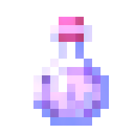

## Nice to meet you! 

Hi there!  My name is Bella Tarantino, and I am a rising sophomore at Harvard University concentrating in physics with a secondary in computer science.  Last summer, I was employed at Google as a STEP intern and worked on the end-to-end development of a few features on an internal platform.  Looking for research for Summer 2022.

### About Me

**Name**: Bella Tarantino

**Pronouns**: they/them

**Languages**: English (Native), Chinese (Advanced)

**Currently Learning**: Backend web development and Kotlin

**Career Interests**: Quantum computing, software development

**Hobbies**: Woodworking, Minecraft, yoga

### Programming Languages

&nbsp;&nbsp;
&nbsp;&nbsp;
&nbsp;&nbsp;
&nbsp;&nbsp;
&nbsp;&nbsp;
&nbsp;&nbsp;
&nbsp;&nbsp;

### Frameworks and Libraries

&nbsp;&nbsp;
&nbsp;&nbsp;
&nbsp;&nbsp;
&nbsp;&nbsp;
&nbsp;&nbsp;
&nbsp;&nbsp;
&nbsp;&nbsp;
&nbsp;&nbsp;
&nbsp;&nbsp;
&nbsp;&nbsp;

### Contact Me

&nbsp;&nbsp;
&nbsp;&nbsp;

